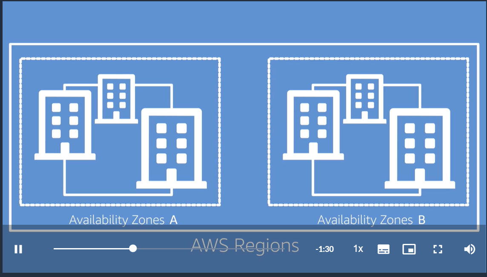

# Amazon Security Fundamentals 
## Resumen de curso AWS Security Fundamentals (Second Edition)
### [url del curso](https://www.aws.training/)

- Control 
- Auditoria 
- Visibilidad

## Principios de diseño: 

- Implemente el principio de mínimo privilegio y aplique la separación de obligaciones con la autorización correspondiente para cada interacción con los recursos de AWS.

- Habilite la trazabilidad: Monitoree, configure alertas y audite acciones y cambios en su entorno en tiempo real. Integre los registros y las métricas a los sistemas para responder y tomar medidas de manera automática.

- Aplique la seguridad en todas las capas: En lugar de centrarse solo en proteger una única capa exterior, aplique un enfoque de defensa en profundidad con otros controles de seguridad.

- Automatice las prácticas recomendadas de seguridad: Los mecanismos automatizados de seguridad basados en software mejoran su capacidad de escalar recursos de manera más segura, rápida y rentable. Implemente controles definidos y administrados como código en plantillas con control de versiones.

- Proteja los datos en tránsito y en reposo: Clasifique los datos en niveles de confidencialidad y, cuando corresponda, utilice mecanismos como el cifrado y el control de acceso

- Aplique el principio de mínimo privilegio: El acceso a los datos solo debe concederse a las personas que realmente lo necesitan. Comience por denegar el acceso a todo y conceda acceso según sea necesario.

- Prepárese para eventos de seguridad: Prepárese para un incidente implementando un proceso de recuperación de desastres que se ajuste a los requisitos de su organización. Ejecute simulaciones de respuesta ante incidentes y use herramientas con automatización a fin de aumentar la velocidad de detección, la investigación y reducir los tiempos de recuperación.

# Modelo de responsabilidad compartida de AWS
AWS se encarga de proteger la infraestructura global que ejecuta todos los servicios ofrecidos en la nube de AWS. Esta infraestructura comprende el hardware, el software, las redes y las instalaciones que ejecutan los servicios de AWS.

Como cliente de AWS, **usted es responsable de proteger los datos, los sistemas operativos, las redes, las plataformas y otros recursos que cree en la nube de AWS.** También es responsable de proteger la confidencialidad, la integridad y la disponibilidad de sus datos y de cumplir cualquier requisito empresarial o de regulación específico para sus cargas de trabajo.

AWS agrupa sus centros de datos fisicos en unidades logicas (Zonas de disponibilidad)  ahí los centros estan inerconectados de forma redundante dedicada  con baja latencia, estas se agrupan en Regiones que contienen dos o más ZdD fisicamente separadas y aisladas entre si  en caso de que una falle.

Algunas regiones no tiene algunos servicios, se debe de decidir cual utilizar con base en la cercania del usuario final y los requicitos de legislación, **Los precios varian con base en las normas de los paises, los gastos operativos y de capital, como la electricidad etc.**
